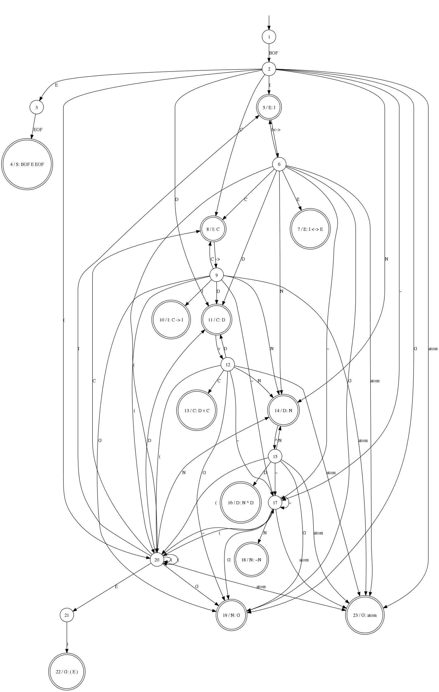
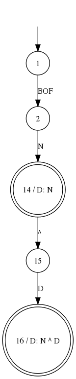

I've found that I never really understand anything related to computer science
until I try implementing it myself. With that in mind, I also like to build
stuff that will help me in more than one subject.

So I decided to build a parser for [Propositional Logic][].

This post will concern parsing using LR and SLR.

[Propositional Logic]: http://en.wikipedia.org/wiki/Propositional_calculus

The Grammar
===========

I got the Context Free Grammar (CFG) for Form(Lp) from here: [http://www.oursland.net/aima/propositionApplet.html]()

It looks like this:

    S: BOF E EOF
    E: I <-> E      (equivalence)
    E: I
    I: C
    I: C -> I       (implication)
    C: D
    C: D v C        (or)
    D: N
    D: N ^ D        (and)
    N: ~N           (negation)
    N: G
    G: ( E )
    G: atom

This grammar allows for expressions in the form: `(A->AvB)->B^C<->~A^C`

**NOTE**: The character `:` is used here instead of `->` for the CFG because
`->` is one of the tokens in the grammar itself.

The Handle DFA
==============

Using the grammar as a simple starting point, the most intuitive construction
of the handle DFA looks like this:

Here, double circled states indicate states where a reduction can occur and what rule to reduce by. 

**Problem 1:** What happens when you try to parse `BOF ~ A EOF` with this
handle DFA?

From `BOF`, we go from 1 to 2.

From `~`, we go from 2 to 17.

But now we're in state 17 and we have `atom` as an input token (with a lexeme
of `A`).

Our DFA has no definition for this, so it would error. 

**Solution to Problem 1:** Any state with transitions for a nonterminal (State
17 on `N` in the example) must also have transitions allowing for the
construction of that nonterminal. In the example, this means that 17 must have
transitions to 19 on `G`, 23 on `atom` and 20 on `(`. 

Unfortunately, this means adding a *lot* of edges. The resulting DFA looks like so:

Shift Reduce Conflicts
======================

**Problem 2:** How do you know whether to shift or reduce?

In the below portion of the DFA, if your current read input is `BOF N` and you
receive the input token `^`, how do you know to shift instead of reducing by
`D: N`?

**Solution to Problem 2:** This is where SLR(1) and Follow(A) come in.

We only want to reduce if the next input token can follow the LHS of that rule. 

**Follow(A) is the set of all terminals that can legally follow the non-terminal A.**

Follow(A) looks like so for this grammar.

     A |       Follow(A) 
    ---+----------------------
     S | {Empty Set}
     E | ), EOF
     I | <->, ), EOF
     C | ->, <->, ), EOF
     D | v, ->, <->, ), EOF
     N | ^, v, ->, <->, ), EOF
     G | ^, v, ->, <->, ), EOF

This was constructed by looking in the grammar for terminals which follow a
specific symbol, remembering that Follow(A) must contain all the elements of
Follow(B) if there exists a rule `A: ...B`. 

In this specific example, Follow(D) must contain all the elements in Follow(C)
because of the rule `C: D`. 

By using Follow(A), we can resolve the shift-reduce conflict as follows:

Let S be a state in which there are shift transitions for all input tokens in the set I.

Let y be the current input token.

If the intersection of I and Follow(X) is not null, the conflict cannot be resolved
under SLR(1). Therefore the grammar is not SLR(1).

**Sidenote:** The following grammar is not parsable by SLR(1) due to an unresolvable shift-reduce conflict:

    S : BOF E EOF
    E : x
    E : xx
    E : Ex

Otherwise, if S has a reduce rule with left hand side X: if y is in Follow(X), reduce by the rule, otherwise if y is in I, shift appropriately. If y is neither in Follow(X) nor in I, a parsing error should be thrown.

The SLR(1) Parse Table
======================
By using the DFA and Follow described above, we can construct the table below.

In this table, `sX` indicates a shift to state X, and `rY` indicates a reduce by rule Y, where the numbers are as follows:

    ( 0) S: BOF E EOF
    ( 1) E: I <-> E      (equivalence)
    ( 2) E: I
    ( 3) I: C
    ( 4) I: C -> I       (implication)
    ( 5) C: D
    ( 6) C: D v C        (or)
    ( 7) D: N
    ( 8) D: N ^ D        (and)
    ( 9) N: ~N           (negation)
    (10) N: G
    (11) G: ( E )
    (12) G: atom

Note that the X refers to a state #, where Y refers to a rule # (s2 and r2 do *not* refer to the same #2).

<table border=1 style='border-collapse: collapse'> 
<tr> 
  <td></td> 
  <td>BOF</td> 
  <td>EOF</td> 
  <td>&lt;-&gt;</td> 
  <td>-&gt;</td> 
  <td>v</td> 
  <td>^</td> 
  <td>~</td> 
  <td>(</td> 
  <td>)</td> 
  <td>atom</td> 
  <td>S</td> 
  <td>E</td> 
  <td>I</td> 
  <td>C</td> 
  <td>D</td> 
  <td>N</td> 
  <td>G</td> 
 </tr> 
 <tr> 
  <td>1</td> 
  <td>s2</td> 
  <td></td> 
  <td></td> 
  <td></td> 
  <td></td> 
  <td></td> 
  <td></td> 
  <td></td> 
  <td></td> 
  <td></td> 
  <td></td> 
  <td></td> 
  <td></td> 
  <td></td> 
  <td></td> 
  <td></td> 
  <td></td> 
 </tr> 
 <tr> 
  <td>2</td> 
  <td></td> 
  <td></td> 
  <td></td> 
  <td></td> 
  <td></td> 
  <td></td> 
  <td>s17</td> 
  <td>s20</td> 
  <td></td> 
  <td>s23</td> 
  <td></td> 
  <td>s3</td> 
  <td>s5</td> 
  <td>s8</td> 
  <td>s11</td> 
  <td>s14</td> 
  <td>s19</td> 
 </tr> 
 <tr> 
  <td>3</td> 
  <td></td> 
  <td>s4</td> 
  <td></td> 
  <td></td> 
  <td></td> 
  <td></td> 
  <td></td> 
  <td></td> 
  <td></td> 
  <td></td> 
  <td></td> 
  <td></td> 
  <td></td> 
  <td></td> 
  <td></td> 
  <td></td> 
  <td></td> 
 </tr> 
 <tr> 
  <td>4</td> 
  <td></td> 
  <td></td> 
  <td></td> 
  <td></td> 
  <td></td> 
  <td></td> 
  <td></td> 
  <td></td> 
  <td></td> 
  <td></td> 
  <td></td> 
  <td></td> 
  <td></td> 
  <td></td> 
  <td></td> 
  <td></td> 
  <td></td> 
 </tr> 
 <tr> 
  <td>5</td> 
  <td></td> 
  <td>r2</td> 
  <td>s6</td> 
  <td></td> 
  <td></td> 
  <td></td> 
  <td></td> 
  <td></td> 
  <td>r2</td> 
  <td></td> 
  <td></td> 
  <td></td> 
  <td></td> 
  <td></td> 
  <td></td> 
  <td></td> 
  <td></td> 
 </tr> 
 <tr> 
  <td>6</td> 
  <td></td> 
  <td></td> 
  <td></td> 
  <td></td> 
  <td></td> 
  <td></td> 
  <td>s17</td> 
  <td>s20</td> 
  <td></td> 
  <td>s23</td> 
  <td></td> 
  <td>s7</td> 
  <td>s5</td> 
  <td>s8</td> 
  <td>s11</td> 
  <td>s14</td> 
  <td>s19</td> 
 </tr> 
 <tr> 
  <td>7</td> 
  <td></td> 
  <td>r1</td> 
  <td></td> 
  <td></td> 
  <td></td> 
  <td></td> 
  <td></td> 
  <td></td> 
  <td>r1</td> 
  <td></td> 
  <td></td> 
  <td></td> 
  <td></td> 
  <td></td> 
  <td></td> 
  <td></td> 
  <td></td> 
 </tr> 
 <tr> 
  <td>8</td> 
  <td></td> 
  <td>r4</td> 
  <td>r4</td> 
  <td>s9</td> 
  <td></td> 
  <td></td> 
  <td></td> 
  <td></td> 
  <td>r4</td> 
  <td></td> 
  <td></td> 
  <td></td> 
  <td></td> 
  <td></td> 
  <td></td> 
  <td></td> 
  <td></td> 
 </tr> 
 <tr> 
  <td>9</td> 
  <td></td> 
  <td></td> 
  <td></td> 
  <td></td> 
  <td></td> 
  <td></td> 
  <td>s17</td> 
  <td>s20</td> 
  <td></td> 
  <td>s23</td> 
  <td></td> 
  <td></td> 
  <td>s10</td> 
  <td>s8</td> 
  <td>s11</td> 
  <td>s14</td> 
  <td>s19</td> 
 </tr> 
 <tr> 
  <td>10</td> 
  <td></td> 
  <td>r3</td> 
  <td>r3</td> 
  <td></td> 
  <td></td> 
  <td></td> 
  <td></td> 
  <td></td> 
  <td>r3</td> 
  <td></td> 
  <td></td> 
  <td></td> 
  <td></td> 
  <td></td> 
  <td></td> 
  <td></td> 
  <td></td> 
 </tr> 
 <tr> 
  <td>11</td> 
  <td></td> 
  <td>r6</td> 
  <td>r6</td> 
  <td>r6</td> 
  <td>s12</td> 
  <td></td> 
  <td></td> 
  <td></td> 
  <td>r6</td> 
  <td></td> 
  <td></td> 
  <td></td> 
  <td></td> 
  <td></td> 
  <td></td> 
  <td></td> 
  <td></td> 
 </tr> 
 <tr> 
  <td>12</td> 
  <td></td> 
  <td></td> 
  <td></td> 
  <td></td> 
  <td></td> 
  <td></td> 
  <td>s17</td> 
  <td>s20</td> 
  <td></td> 
  <td>s23</td> 
  <td></td> 
  <td></td> 
  <td></td> 
  <td>s13</td> 
  <td>s11</td> 
  <td>s14</td> 
  <td>s19</td> 
 </tr> 
 <tr> 
  <td>13</td> 
  <td></td> 
  <td>r5</td> 
  <td>r5</td> 
  <td>r5</td> 
  <td></td> 
  <td></td> 
  <td></td> 
  <td></td> 
  <td>r5</td> 
  <td></td> 
  <td></td> 
  <td></td> 
  <td></td> 
  <td></td> 
  <td></td> 
  <td></td> 
  <td></td> 
 </tr> 
 <tr> 
  <td>14</td> 
  <td></td> 
  <td>r8</td> 
  <td>r8</td> 
  <td>r8</td> 
  <td>r8</td> 
  <td>s15</td> 
  <td></td> 
  <td></td> 
  <td>r8</td> 
  <td></td> 
  <td></td> 
  <td></td> 
  <td></td> 
  <td></td> 
  <td></td> 
  <td></td> 
  <td></td> 
 </tr> 
 <tr> 
  <td>15</td> 
  <td></td> 
  <td></td> 
  <td></td> 
  <td></td> 
  <td></td> 
  <td></td> 
  <td>s17</td> 
  <td>s20</td> 
  <td></td> 
  <td>s23</td> 
  <td></td> 
  <td></td> 
  <td></td> 
  <td></td> 
  <td>s16</td> 
  <td>s14</td> 
  <td>s19</td> 
 </tr> 
 <tr> 
  <td>16</td> 
  <td></td> 
  <td>r7</td> 
  <td>r7</td> 
  <td>r7</td> 
  <td>r7</td> 
  <td></td> 
  <td></td> 
  <td></td> 
  <td>r7</td> 
  <td></td> 
  <td></td> 
  <td></td> 
  <td></td> 
  <td></td> 
  <td></td> 
  <td></td> 
  <td></td> 
 </tr> 
 <tr> 
  <td>17</td> 
  <td></td> 
  <td></td> 
  <td></td> 
  <td></td> 
  <td></td> 
  <td></td> 
  <td>s17</td> 
  <td>s20</td> 
  <td></td> 
  <td>s23</td> 
  <td></td> 
  <td></td> 
  <td></td> 
  <td></td> 
  <td></td> 
  <td>s18</td> 
  <td>s19</td> 
 </tr> 
 <tr> 
  <td>18</td> 
  <td></td> 
  <td>r9</td> 
  <td>r9</td> 
  <td>r9</td> 
  <td>r9</td> 
  <td>r9</td> 
  <td></td> 
  <td></td> 
  <td>r9</td> 
  <td></td> 
  <td></td> 
  <td></td> 
  <td></td> 
  <td></td> 
  <td></td> 
  <td></td> 
  <td></td> 
 </tr> 
 <tr> 
  <td>19</td> 
  <td></td> 
  <td>r10</td> 
  <td>r10</td> 
  <td>r10</td> 
  <td>r10</td> 
  <td>r10</td> 
  <td></td> 
  <td></td> 
  <td>r10</td> 
  <td></td> 
  <td></td> 
  <td></td> 
  <td></td> 
  <td></td> 
  <td></td> 
  <td></td> 
  <td></td> 
 </tr> 
 <tr> 
  <td>20</td> 
  <td></td> 
  <td></td> 
  <td></td> 
  <td></td> 
  <td></td> 
  <td></td> 
  <td>s17</td> 
  <td>s20</td> 
  <td></td> 
  <td>s23</td> 
  <td></td> 
  <td>s21</td> 
  <td>s5</td> 
  <td>s8</td> 
  <td>s11</td> 
  <td>s14</td> 
  <td>s19</td> 
 </tr> 
 <tr> 
  <td>21</td> 
  <td></td> 
  <td></td> 
  <td></td> 
  <td></td> 
  <td></td> 
  <td></td> 
  <td></td> 
  <td></td> 
  <td>s22</td> 
  <td></td> 
  <td></td> 
  <td></td> 
  <td></td> 
  <td></td> 
  <td></td> 
  <td></td> 
  <td></td> 
 </tr> 
 <tr> 
  <td>22</td> 
  <td></td> 
  <td>r11</td> 
  <td>r11</td> 
  <td>r11</td> 
  <td>r11</td> 
  <td>r11</td> 
  <td></td> 
  <td></td> 
  <td>r11</td> 
  <td></td> 
  <td></td> 
  <td></td> 
  <td></td> 
  <td></td> 
  <td></td> 
  <td></td> 
  <td></td> 
 </tr> 
 <tr> 
  <td>23</td> 
  <td></td> 
  <td>r12</td> 
  <td>r12</td> 
  <td>r12</td> 
  <td>r12</td> 
  <td>r12</td> 
  <td></td> 
  <td></td> 
  <td>r12</td> 
  <td></td> 
  <td></td> 
  <td></td> 
  <td></td> 
  <td></td> 
  <td></td> 
  <td></td> 
  <td></td> 
 </tr> 
</table> 

**NOTE:** There is no rule to reduce by `S: BOF E EOF` in this table. 
This is because no token can follow S (EOF is always the last token).
